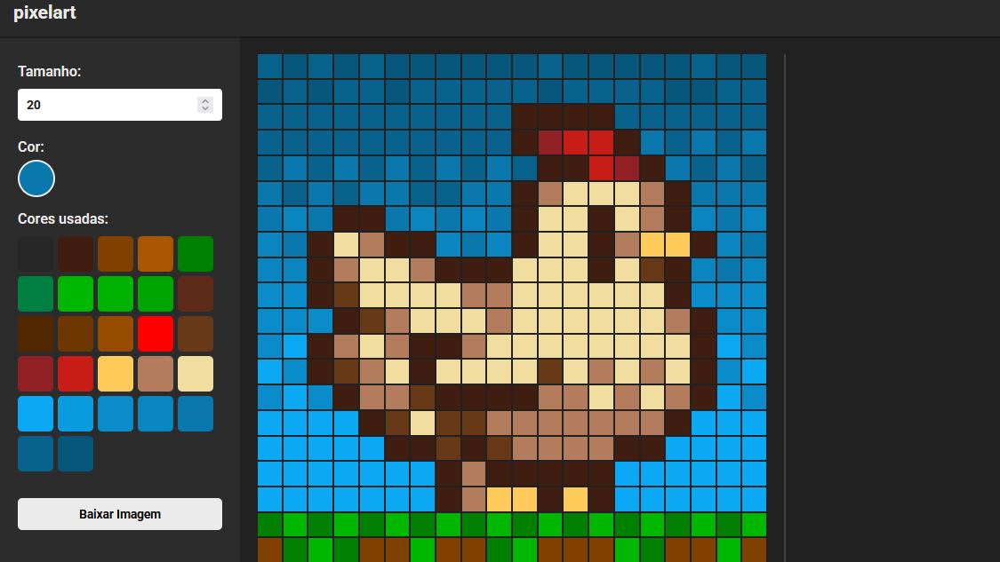

<a id="readme-topo"></a>

<div align="center">

  <h1 align="center">Pixel Art - Editor Web</h1>
  <p>
  Projeto com foco educacional e prático, explorando conceitos como manipulação do DOM, eventos e renderização dinâmica usando JavaScript Vanilla.
  <br>
  <a href="#sobre">sobre</a>
  &middot;
  <a href="#tecnologias-ferramentas">tecnologias e ferramentas</a>
  &middot;
  <a href="#organizacao">organização dos arquivos</a>
  &middot;
  <a href="#limitacoes">limitações</a>
  &middot;
  <a href="#como-executar">como executar</a>
</p>

  
   
  

</div>

<br>

## Sobre o Editor

<a id="sobre"></a>



> Editor web simples para criação de pixel art, permitindo personalização do tamanho da grade, seleção e reutilização de cores e exportação da arte final em PNG.

### Funcionalidades

<details>
  <summary> <b> Criação do Canvas </b> (ver mais)</summary>

> O canvas é construído dinamicamente com base no valor definido pelo usuário, gerando uma grade quadrada de pixels interativos.

</details>

<details>
  <summary> <b> Pintura dos Pixels </b> (ver mais)</summary>

> Cada pixel reage a eventos de mouse, permitindo pintura contínua enquanto o botão estiver pressionado.

</details>

<details>
  <summary> <b> Gerenciamento de Cores </b> (ver mais)</summary>

> As cores selecionadas são armazenadas e exibidas como botões reutilizáveis, evitando duplicações.

</details>

<details>
  <summary> <b> Redimensionamento do Canvas </b> (ver mais)</summary>

> O usuário pode ajustar visualmente o tamanho do canvas arrastando a coluna lateral.

</details>

<details>
  <summary> <b> Exportação </b> (ver mais)</summary>

> A arte final é convertida em imagem PNG e baixada ao clicar no botão `Baixar imagem`.

</details>

### Conceitos Aplicados

-   Criação dinâmica de elementos HTML
-   Manipulação de eventos (mousedown, mouseup, mouseover, mousemove)
-   Controle de estado (isPainting, isResizing)
-   Uso de atributos customizados (data-\*)
-   Integração com biblioteca externa para captura de canvas (html2canvas)

<p align="right">(<a href="#readme-topo">voltar ao topo</a>)</p>

## Tecnologias e Ferramentas

<a id="tecnologias-ferramentas"></a>

-   **JavaScript**
-   **HTML**
-   **CSS**
-   **html2canvas (biblioteca js)**
    <br>
    <br>
-   **Visual Studio Code IDE**
-   **Live Server (extensão)**

<p align="right">(<a href="#readme-topo">voltar ao topo</a>)</p>

## Organização dos Arquivos

<a id="organizacao"></a>

```
js-pixel-art-editor/
│
├── index.html          # estrutura
├── styles.css           # estilos
├── script.js           # lógica do editor
│
├── docs-readme/        # recursos visuais
│   └── screenshots/
│
└── README.md           # este arquivo
```

<p align="right">(<a href="#readme-topo">voltar ao topo</a>)</p>

## Limitações

<a id="limitacoes"></a>

-   Pixels não pintados também são considerados na imagem
-   Não há sistema de desfazer/refazer para correções
-   O estado da arte não é persistida ao recarregar a página
-   Resolução maiores depende do quão o canvas está expandido
-   Pixels ficam com "borda" sem fundo mais evidente em imagens do canvas menor

<br>

> [!TIP]
> Para obter melhor qualidade de exportação, expanda o canvas antes de baixar a arte.
> Se necessário, reduza o zoom da página e expanda ainda mais o canvas.

<p align="right">(<a href="#readme-topo">voltar ao topo</a>)</p>

## Como Executar

<a id="como-executar"></a>

**1. Baixe o ZIP ou clone o repositório:**

```
git clone https://github.com/daCruzZzLeticia/js-pixel-art-editor
```

**2. Abra o arquivo index.html com navegador**

> Não é necessário servidor ou dependências adicionais

<p align="right">(<a href="#readme-topo">voltar ao topo</a>)</p>
